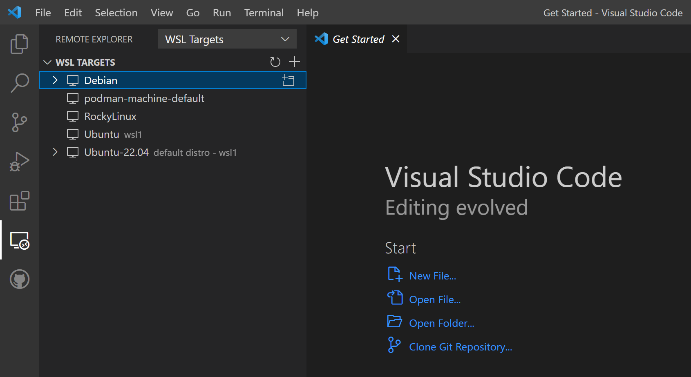
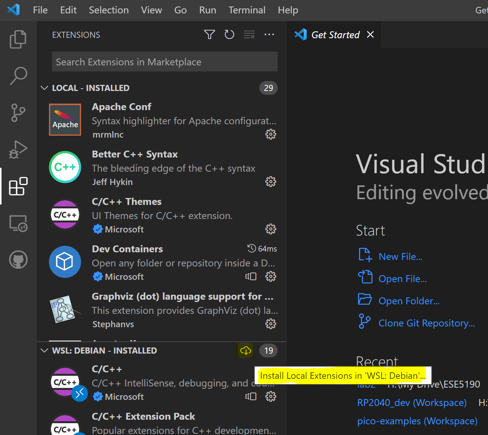
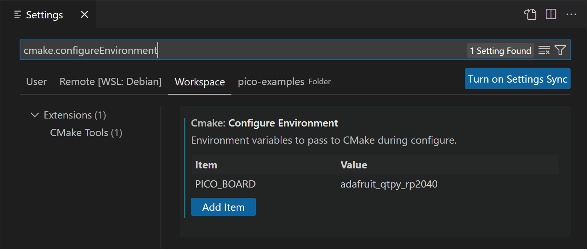
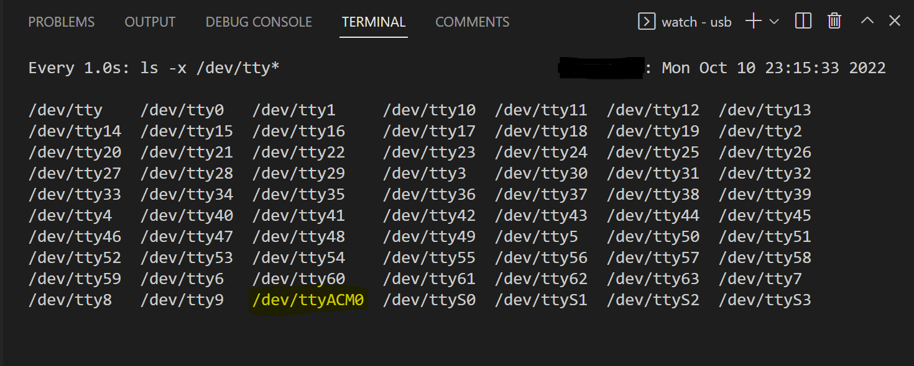
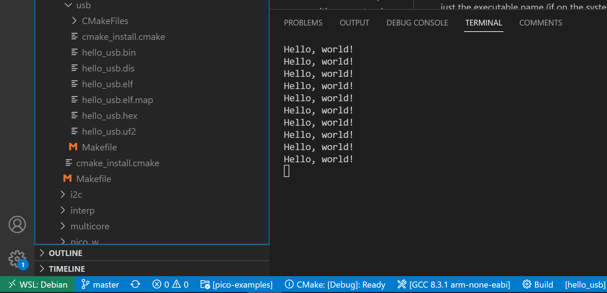

# Setup Guide - Development Environment for RP2040
Nikola Obradovic

## Introduction
This guide will walk you through setting up a development environment for the Adafruit QT Py - RP2040. I had (perhaps overly) elaborate plans for my dev environment, which have been pared down slightly. The last section of the guide will lay out the issues I ran into and what it would take to overcome them.

I eventually decided that setting up the environment in the Windows Subsystem for Linux accomplished my main goal of providing an isolated, controlled environment, while avoiding the complexity (and show-stopping bugs) of a Dev Container-based setup.

I used the Windows Terminal for most of the command-line tasks in this guide. For cases where I was entering the commands into the default PowerShell profile, I'll mark the line with `PS>`. For commands entered into the WSL shell, I'll use `[me@wsl] $`. You shouldn't type these parts. You can install the Terminal painlessly using winget: in a PowerShell window with elevated privileges (run PowerShell as Administrator), enter:
``` 
PS> winget install Microsoft.WindowsTerminal
```


### Contents
1. Installing the Windows Subsystem for Linux
   1. Optional: Use the distribution of your choice
2. Installing and Configuring Visual Studio Code
3. Configuring Your Linux Environment
4. Setting Up the RP2040 SDK and Building an Example
5. Extra Mile - Connect USB device to WSL
   1. Future Work: Down the Rabbit Hole (mounting RP2040 UF2 Bootloader to WSL)
6. Connect to QT Py to Run Example
7. Keep It Simple, Stupid!


## Installing the Windows Subsystem for Linux

Microsoft has several guides that will walk you through the steps needed to set up the Windows Subsystem for Linux. Rather than try to cover every edge case myself, I recommend first following the guide [Install Linux on Windows with WSL](https://learn.microsoft.com/en-us/windows/wsl/install). The default Ubuntu distribution will be sufficient for our purposes. You will want to use WSL 2, which may require you to use the `PS> wsl --set-version` command once you have installed a Linux distribution.

If you are feeling adventurous, you can follow the steps in the optional section below to create your own custom Linux filesystem image and import it into WSL.

### Optional: Use the distribution of your choice

My original intention was to use [Development Containers](https://containers.dev/) to create a replicable environment that could be easily copied to any computer capable of hosting containers. I will go into more detail about my plans and why that didn't pan out in the final section of this guide, but from failure comes opportunity! I had planned on using the Microsoft-provided C++ dev container ([found here](https://github.com/devcontainers/images/tree/main/src/cpp)) as the base of my container definition, so when that plan didn't work out, I decided to use it as the foundation of my WSL installation instead.

Any Linux distribution can be used with the WSL: all you need is an archive file (.tar) containing the root filesystem of your chosen distribution. Luckily, container images can be exported as archives which are compatible with WSL. Following [this](https://learn.microsoft.com/en-us/windows/wsl/use-custom-distro) guide from Microsoft, I pulled the C++ dev container, exported it, and created a new WSL distribution:
1. Install a container host program such as [Docker Desktop](https://learn.microsoft.com/en-us/windows/wsl/tutorials/wsl-containers#install-docker-desktop). I already had [Podman for Windows](https://github.com/containers/podman/blob/main/docs/tutorials/podman-for-windows.md) installed, so I'll be using that for this guide. For the most part, the Docker commands are equivalent, but refer to the Microsoft tutorial if you have doubts.
2. We need a container to export, not just an image, so we'll need to start a container using the image we want to use. This will also fetch the image from the online repository: 
   ```
   PS> podman run mcr.microsoft.com/devcontainers/cpp:0-bullseye
   ``` 
   NOTE: this is the image that I used, but in hindsight, it may be easier to use the `:ubuntu` tag instead of `:0-bullseye` (Debian 11). Many of the RP2040 tutorials are written assuming you are using Ubuntu, and it will make following the tutorial easier when it comes time to attach the QT Py to our WSL instance.
3. Print a list of containers to get the ID of the container we just created(ours is no longer running since it exited immediatly after starting):
   ```
   PS> podman ps -a
   CONTAINER ID  IMAGE                                           COMMAND CREATED        STATUS
   96c5b54d5dd5  mcr.microsoft.com/devcontainers/cpp:0-bullseye  bash    2 minutes ago  Up 2 minutes ago
   ```
4. Using the Container ID, export an archive containing the root filesystem. Make sure you provide a filepath that you'll remember: 
   ```
   PS> podman export 96c5b54d5dd5 C:\Users\myusername\Desktop\devcontainer.tar
   ```
5. Import the archive into the WSL, providing a name for your WSL instance and a path where the WSL files will be stored. You don't want to edit these files yourself after they're created, so put them somewhere out of the way. Make sure the directory exists before running this command:
   ```
   PS> wsl --import RP2040Dev C:\WSLStorage\RP2040Dev C:\Users\myusername\Desktop\devcontainer.tar
   ```
6. If your default WSL version was not set to 2, you will need to upgrade the newly created distribution:
   ```
   PS> wsl --set-version RP2040Dev 2
   ```
7. Start your new WSL distribution:
   ```
   PS> wsl -d RP2040Dev
   ```
8. Since the container image we used was intended for use as a dev container, we need to make some quick changes to rename the default user account and set it as the default account:
   ```
   [root@wsl] $ myUsername=<your username>
   [root@wsl] $ usermod -l $myUsername vscode
   [root@wsl] $ groupmod -n $myUsername vscode
   [root@wsl] $ usermod -m -d /home/$myUsername $myUsername
   [root@wsl] $ usermod -aG sudo $myUsername
   [root@wsl] $ passwd $myUsername
   [root@wsl] $ echo -e "[user]\ndefault=$myUsername" >> /etc/wsl.conf

9. Exit WSL and terminate the distribution so that it will restart with the changes you have made: 
   ```
   [root@wsl] $ exit
   PS> wsl --terminate RP2040Dev
   ```
   You are now ready for the next section.


## Configuring Your Linux Environment

Some additional packages will need to be installed, and some are handy to have even if they're not necessary. These packages are the ones I installed on top of the C++ Development Container Debian image, so if you are using a different distribution, you may have to find alternatives if these are not available in that distribution's repositories (side note: this is why I abandoned my original plan of using a Rocky Linux container image as my development environment base. The gcc-arm-none-eabi package is not available. I could have installed from source, but that seemed like more effort than it was worth):
```
[me@wsl] $ sudo apt install gcc-arm-none-eabi build-essential cmake vim libstdc++-arm-none-eabi-newlib doxygen graphviz hwdata apt-file screen
```

## Installing and Configuring Visual Studio Code

Follow [this](https://learn.microsoft.com/en-us/windows/wsl/tutorials/wsl-vscode) guide by Microsoft to install VS Code and the WSL extension.

I recommend the following extensions:
```
chris-hock.pioasm
codezombiech.gitignore
cschlosser.doxdocgen
GitHub.vscode-pull-request-github
jeff-hykin.better-cpp-syntax
mhutchie.git-graph
ms-python.python
ms-python.vscode-pylance
ms-vscode-remote.remote-containers
ms-vscode-remote.remote-ssh
ms-vscode-remote.remote-ssh-edit
ms-vscode-remote.remote-wsl
ms-vscode-remote.vscode-remote-extensionpack
ms-vscode.cmake-tools
ms-vscode.cpptools
ms-vscode.cpptools-extension-pack
ms-vscode.cpptools-themes
ms-vscode.makefile-tools
twxs.cmake
```

Once they are installed, connect to your WSL distribution using the Remotes browser, located in the left-hand toolbar.



Once you are connected, install your local extensions into the WSL environment by clicking on the cloud icon in the Extensions panel:



You can open a terminal in your WSL distribution through VS Code using ``` Ctrl+` ```

## Setting Up the RP2040 SDK and Building an Example


From this point, you should be able to follow the steps in Chapter 2 and 4 of the [Getting Started with Pico](https://datasheets.raspberrypi.com/pico/getting-started-with-pico.pdf) guide.

Once the tutorial asks you to set the PICO_SDK_PATH variable, use the following command to add the appropriate line to the end of your `.bashrc` file:
```
[me@wsl] $ echo -e "export PICO_SDK_PATH=/path/to/your/sdk/checkout" >> ~/.bashrc
```
You will have to close and reopen VS Code so that its user session in WSL has the variable set.

You'll need to set the PICO_BOARD variable for CMake to know which board you want to compile for. I set this in the settings of the CMake Tools VSCode extension. You can search in VSCode settings for `cmake.configureEnvironment`. The value of the item should be 'adafruit_qtpy_rp2040' (no quotes).



Now you can follow Chapter 7.2 of the Getting Started guide to build the example with CMake. Once you have this working, you'll probably need to copy the generated .elf file back to Windows to flash it to the board. More on that in the next section.

## Extra Mile - Connect USB device to WSL

At this point, it is possible to develop and test programs for the QT Py by moving the .uf2 files from WSL to the host Windows environment, copying them to the USB bootloader, and connecting to the USB serial port using Cygwin. However, wouldn't it be nice to be able to at least monitor the device from the same environment that we are developing in?

Although WSL currently does not support directly mapping USB devices to the Linux environment, a program called [usbipd-win](https://github.com/dorssel/usbipd-win) can be used to tunnel the USB connection through a network connection between the host and guest OS.

To install the Windows components, we can again use `winget`:
```
PS> winget install usbipd
```
In the Linux distribution, install the following packages (for Debian; for Ubuntu, use the instructions from [this](https://github.com/dorssel/usbipd-win/wiki/WSL-support) page):

```
[me@wsl] $ sudo apt install usbip usbutils udev
```

From Windows, use the following to list the available USB devices:
```
PS> usbipd list
Connected:
BUSID    VID:PID    DEVICE                             STATE
1-6      1286:204c  Marvell AVASTAR Bluetooth Radio    Not Shared
4-2      2e8a:000a  USB Serial Device (COM4), Reset    Not Shared
```

The QY Py device will be one of the devices present here. Try running the command before and after you connect the QT Py to help determine which one it is. Once you have determined that, use the following commands to attach it to the WSL instance, where BUSID is the ID of the QY Py (e.g. `4-2`):

```
PS> usbipd bind --busid=<BUSID>
PS> usbipd wsl attach --busid <BUSID> -d RP2040Dev
```

You can return control of the device to Windows with the following:
```
PS> usbipd wsl detach --busid <BUSID>
```

If you are frequently resetting the board and would like it to automatically reattach to WSL, you can append `--auto-attach` to the `usbipd wsl attach` command.

If you place your QT Py into the bootloader mode (by holding the BOOT button and resetting it), it can still be attached to WSL, but you will not be able to access the storage to flash new firmware. This is a known limitation of WSL. You will still need to copy your .uf2 files to Windows for this. Your Windows drives are available in WSL under `/mnt/c`, `/mnt/d`, etc. Just drop the hello_usb.uf2 file onto the QT Py drive in Windows Explorer.

Be careful to not attach your mouse or keyboard to WSL! If you do, you may need to use another USB keyboard to detach it again (or an on-screen keyboard if you have a touchscreen).


### Future Work: Down the Rabbit Hole (mounting RP2040 UF2 Bootloader to WSL)
I have given up (for the moment) on trying to mount the QY Py bootloader to the WSL distribution so that the .uf2 binaries can be loaded seamlessly by VS Code/CMake. [This](https://github.com/microsoft/WSL/issues/689) GitHub issue, [this](https://devblogs.microsoft.com/commandline/connecting-usb-devices-to-wsl/#comment-5643) comment on a Microsoft blog post indicate that there is no straightforward way to mount a USB mass storage device to WSL currently. I could attempt [this](https://github.com/jovton/USB-Storage-on-WSL2) workaround, which suggests mapping the removable drive as an iSCSI target, but at some point you have to ask yourself if the cure is worse than the disease (plus, I'm not sure how this will interact with the `--auto-attach` feature of `usbipd` that I use to reconnect the drive once it has been programmed and reset).

## Connect to QT Py to Run Example

Once you have attached the QT Py to WSL, you can access the serial port using a utility like Screen. First, however, we will need to know how the device is mapped in our Linux environment. You can use the following line to monitor `/dev` for changes while you attach the QT Py to WSL with usbipd, which will help you locate the correct device.

```
[me@wsl] $ watch -d -n 1 "ls -x /dev/tty*"
```
Now, attach the QT Py:
```
PS> usbipd wsl attach --busid <BUSID> -d RP2040Dev --auto-attach
```
The output will look similar to:



Connect Screen to the device with the following line:

```
[me@wsl] $ screen /dev/ttyACM0 115200
```

You should see the output below: 



## Keep It Simple, Stupid!
As I mentioned in a previous section, my original plan was to use the new trendy Dev Containers to create a portable build environment that could be easily copied between workstations. This may have still been possible if I used Docker, but conflicts arise when Docker and Podman are used in the same environment, and I was unwilling to scrap my current container setup. Podman works well on my computer as a standalone tool, but as [this](https://github.com/containers/podman/issues/15338) GitHub issue explains, there is an error that occurs when VS Code attempts to issue commands to podman. I spend no small amount of time troubleshooting here, which is perhaps why I eventually chose to use the dev container image as the base of my WSL distribution. I even tried to use the Remotes - Containers extension nested inside the WSL VS Code extension (connected to the WSL distribution that podman creates to manage the containers), but this ended up not being possible. Would it have been easier to use the default Ubuntu distribution? Yes, probably, and I even already had it installed. Instead, I tried to create my own image using the Rocky Linux base image published in the Docker registry. This eventually turned out to be a bad idea, as I mentioned earlier, because the cross-compile toolchain package was not available in the Rocky Linux repositories. 

I feel like my final setup is "good enough," but I'm keeping a close eye on that podman issue thread to see if any progress is made. I would like to get to the point where I can check out a repository from my GitHub profile that will automatically create a development environment from only a Containerfile and devcontainer.json definition.
